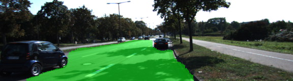
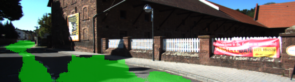
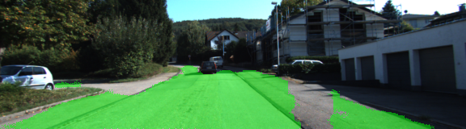
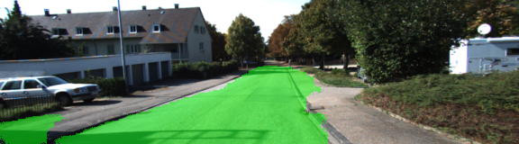

# Semantic Segmentation
### Introduction
In this project, pixels of a road images are labelled using a Fully Convolutional Network (FCN) based on VGG16.
It's a partial re-implementation of the network architecture proposed in [Shelhamer et al](https://people.eecs.berkeley.edu/~jonlong/long_shelhamer_fcn.pdf).

The network consists of an encoder and decoder part. The encoder extracts features and encodes semantic information in a very compact representation within the "bottleneck" of the network by using only convolution layers. From the bottleneck the encoded semantic information is projected back on an image in the decoder part, which is done by upsampling that information to the original image size, also referred to as "transposed convolutions" in the deep-learning community.
In this example the final layer of the decoder network contains two filters, one for the road and one for otherwise. 

For evaluation of segmentation tasks a common accuracy metric is the mean intersection over union metric, it computes a ratio between the intersection and the union of two sets of pixels, where one set would be ground-truth and the other the prediction.


### Setup

#### Using a GPU
`main.py` will check to make sure you are using GPU, training the provided network without a GPU might take days and is therefore not encouraged. If you don't have a GPU on your system, you can use AWS or another cloud computing platform.

#### Frameworks and Packages
Make sure you have the following Python modules installed:
 - [Python 3](https://www.python.org/)
 - [TensorFlow](https://www.tensorflow.org/)
 - [NumPy](http://www.numpy.org/)
 - [SciPy](https://www.scipy.org/)
 
#### Dataset
Download the [Kitti Road dataset](http://www.cvlibs.net/datasets/kitti/eval_road.php) from [here](http://www.cvlibs.net/download.php?file=data_road.zip). Extract the dataset in the `data` folder.  This will create the folder `data_road` with all the training a test images.
For this purpose there is also a helper function (`maybe_download_pretrained_vgg()`) within the file `helper.py`.

#### Run the training
Run the following command to start the training:
```
python main.py 
```
or explicitly start in training mode:
```
python main.py --mode=train
```
**Note** If running this in Jupyter Notebook system messages, such as those regarding test status, may appear in the terminal rather than the notebook.
 
#### Run inference on test images
Call `main.py` with `--mode=test` in order to run the previously trained network on the test images located in `data/data_road/testing`, which also creates a new folder in `runs/` containing the test images with segementation applied.
```
python main.py --mode=test
```

### Implementation details
As base a pre-trained VGG16 convolutional network was used as an encoder network, where only the convolutions have been used, similar to the implementation proposed in [Shelhamer et al](https://people.eecs.berkeley.edu/~jonlong/long_shelhamer_fcn.pdf).
The following operations were extracted from the pre-trained VGG16:
* `image_input`
* `keep_prob`
* `layer3_out` (pooling output)
* `layer4_out` (pooling output)
* `layer7_out` (pooling output)

Layer 7 of the VGG16 network was taken as bottleneck of the encoder-decoder network, a 1x1 convolution with the output of 2 classes was added to adjust the encoder to have only two classes. 
From this layer on the decoder network starts with upsampling layers (transpose convolution), the first one with a filter size of 4 and a stride of 2.
This one was added elementwise to a skip connection from the `layer_4_out` encoder layer.
The resulting layer was then upscaled again by a filter size of 4 and a stride of 2. Again this layer was added elementwise with a skip connection to the `layer_3_out` encoder layer. The last upscale layer consists of a filter size of 16 and a stride of 8, which eventually brings the image back to its original resolution.


### Training
I played with training those two sets of variables:
* only the added decoder layers, except the fully connected ones
* all encoder and decoder layers, except the fully connected ones

Because it was difficult to converge to a low loss and mean IoU value, training was done by manually decreasing the learning rate approx. every 10 epochs, from 1e-3 to 1e-7. The dropout keep probability was set to `0.8` for all training runs.

Training only the added convolutional layers for the decoder network for approx. 60 epochs:
* Mean IoU: 0.766
* Loss: 0.504

Training all convolutional layers of the encoder and decoder for approx. 50 epochs:
* Mean IoU: 0.934
* Loss: 0.146

### Test results
Unfortunately there is no ground-truth data available in the provided KITTI test dataset, therefore no accuracy metric such as the IoU can be provided. Instead, only examples where the segmentation process worked well and not well are discussed briefly.

Here is an example where the segmentation worked well:




And here we see an example of a less accurate segmentation:



It seems that the VGG16 based network doesn't generalize well on shady road areas.
This might be improved when a proper normalization step is applied on the images before feeding it into the network.
Or even image augmentations affecting the brightness and contrast might help to improve the segmentation accuracy.

The network seems also still struggle with distinguishing between road and pedestrian way, which is seen in the next images:






Here I applied the semantic segmentation network on videos which were used in the _advanced lane finding_ project from the first Term of the SelfDrivingCar Nanodegree:


### Conclusion / Future work
After several training attempts it can be concluded that the used VGG16 base architecture seems to be slow and outdated compared to modern MobileNet lightweight network architectures, it is also not easy to train to achieve state-of-the-art results.
Possible improvements:
* Better training strategy with smarter weight decay and early stopping for achieving better loss and mean IoU values
* Applying image augmentations during training
* Try out a lightweight MobileNet variant for faster training / testing cycles
* Exporting graph as protobuf file and optimize it, this should reduce the time to build up the graph with all the made modifications
* Eventually export a highly optimized graph as protobuf file for inference, with all reasonable optimizations for inference turned on


### Project notes
- The link for the frozen `VGG16` model is hardcoded into `helper.py`.  The model can be found [here](https://s3-us-west-1.amazonaws.com/udacity-selfdrivingcar/vgg.zip).
- The model is not vanilla `VGG16`, but a fully convolutional version, which already contains the 1x1 convolutions to replace the fully connected layers. Please see this [post](https://s3-us-west-1.amazonaws.com/udacity-selfdrivingcar/forum_archive/Semantic_Segmentation_advice.pdf) for more information.  A summary of additional points, follow. 
- The original FCN-8s was trained in stages. The authors later uploaded a version that was trained all at once to their GitHub repo.  The version in the GitHub repo has one important difference: The outputs of pooling layers 3 and 4 are scaled before they are fed into the 1x1 convolutions.  As a result, some students have found that the model learns much better with the scaling layers included. The model may not converge substantially faster, but may reach a higher IoU and accuracy. 
- When adding l2-regularization, setting a regularizer in the arguments of the `tf.layers` is not enough. Regularization loss terms must be manually added to your loss function. otherwise regularization is not implemented.
